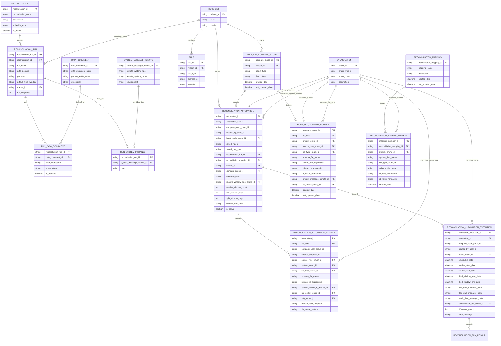

# Reconciliation Configuration Entity Model

This document maps the reconciliation configuration entities to their Moqui definitions in this repo.
The model focuses on configuration, definition storage, and the run-result artifact manifest used to
locate persisted source/result files. Automation execution records track scheduled windows, artifacts,
counts, and sanitized errors; per-rule evaluation history and alerting remain out of scope.

## Source of Truth (Code)

- Reconciliation entities: `runtime/component/darpan/entity/ReconciliationEntities.xml`
- Rule entities: `runtime/component/darpan/entity/RuleEntities.xml`
- Mapping entities: `runtime/component/darpan/entity/MappingEntities.xml`
- DataDocument: `framework/entity/EntityEntities.xml`
- SystemMessageRemote: `framework/entity/ServiceEntities.xml`
- Enumeration: `framework/entity/BasicEntities.xml`
- Automation enum seed data: `runtime/component/darpan/data/AutomationSeedData.xml`

## Entity Relationship Diagram

**Note**
- The diagram uses snake_case field names for readability.
- Source-of-truth field names live in the entity XML files linked above.

## Model Goals

- Define what should be reconciled, not how
- Enable reusable reconciliation runs across clients
- Leverage Moqui-native entities wherever possible
- Keep configuration declarative and schedulable

## Core Entities

### Reconciliation (darpan.reconciliation.Reconciliation)
A schedulable parent entity that groups one or more reconciliation runs.

**Purpose**
- Acts as the orchestration boundary
- Defines scheduling cadence

**Key Fields**
- `reconciliationId`
- `reconciliationName`
- `description`
- `scheduleExpr`
- `isActive`

### ReconciliationRun (darpan.reconciliation.ReconciliationRun)
Defines a single reconciliation check within a reconciliation.

**Purpose**
- Represents one atomic comparison or validation
- Executed as part of a reconciliation group
- Reusable across clients if needed

**Key Fields**
- `reconciliationRunId`
- `reconciliationId`
- `runName`
- `dataDomain` (orders, returns, shipments)
- `purpose` (createdSync, statusMatch, financialMatch)
- `defaultTimeWindow`
- `ruleSetId`
- `runSequence`

**Example linkage**
- `darpan.reconciliation.ReconciliationRun(ruleSetId="INV_ADJ_DEFAULT_RS")` links to `darpan.rule.RuleSet(ruleSetId="INV_ADJ_DEFAULT_RS")`.

**Operational Note**
- Reconciliation ownership is no longer modeled with dedicated party entities in component configuration.

### ReconciliationRunResult (darpan.reconciliation.ReconciliationRunResult)
Persists the artifact manifest for one run execution.

**Purpose**
- Stores the data-manager paths for the two uploaded source files and generated result
- Links a UI saved run (`savedRunId`) to its persisted result artifact
- Keeps tenant ownership on generated run data
- Tracks run lifecycle status so history can show active API-backed extraction before a result file exists

**Key Fields**
- `reconciliationRunResultId`
- `savedRunId`
- `savedRunType` (`ruleset` or `mapping`)
- `reconciliationRunId`
- `reconciliationMappingId`
- `ruleSetId`
- `compareScopeId`
- `companyUserGroupId`
- `createdByUserId`
- `file1DataManagerPath`
- `file2DataManagerPath`
- `resultDataManagerPath`
- `statusEnumId` (`AUT_STAT_RUNNING`, `AUT_STAT_SUCCESS`, or `AUT_STAT_FAILED`)
- `reconciliationType`
- `differenceCount`
- `onlyInFile1Count`
- `onlyInFile2Count`
- `createdDate`
- `startedDate`
- `completedDate`
- `lastUpdatedDate`

### ReconciliationAutomation (darpan.reconciliation.ReconciliationAutomation)
Defines a tenant-owned automation configuration for either API date-range extraction or SFTP file inputs.

**Purpose**
- Stores the schedulable automation record.
- Points at the selected saved run and, for RuleSet-backed runs, the selected `RuleSetCompareScope`.
- Carries date-window configuration used by later execution services to split API extraction windows.

**Key Fields**
- `automationId`
- `automationName`
- `companyUserGroupId`
- `createdByUserId`
- `inputModeEnumId` (`AUT_IN_API_RANGE` or `AUT_IN_SFTP_FILES`)
- `savedRunId`
- `savedRunType`
- `reconciliationRunId`
- `reconciliationMappingId`
- `ruleSetId`
- `compareScopeId`
- `scheduleExpr`
- `nextScheduledFireTime`
- `lastScheduledFireTime`
- `relativeWindowTypeEnumId`
- `relativeWindowCount`
- `maxWindowDays`
- `splitWindowDays`
- `windowTimeZone`
- `safeConfigJson`
- `isActive`

`scheduleExpr` uses the same Quartz-style cron expressions that Moqui `ServiceJob` uses. The shared scanner job runs through Moqui scheduling, then `scan#DueAutomations` selects active automations using `nextScheduledFireTime` when it is precomputed or Moqui's cron execution-time utility when only `scheduleExpr` and `lastScheduledFireTime` are available.

### ReconciliationAutomationSource (darpan.reconciliation.ReconciliationAutomationSource)
Defines one side of the automation input pair.

**Purpose**
- Stores exactly one row per `FILE_1` and `FILE_2` for an automation.
- Reuses the same system, file type, schema, primary ID, and normalizer shape as RuleSet compare sources.
- Adds source-specific pointers for API extraction (`systemMessageRemoteId`, `nsRestletConfigId`) and SFTP polling (`sftpServerId`, `remotePathTemplate`, `fileNamePattern`).

**Key Fields**
- `automationId`
- `fileSide` (`FILE_1` or `FILE_2`)
- `companyUserGroupId`
- `createdByUserId`
- `sourceTypeEnumId` (`AUT_SRC_API` or `AUT_SRC_SFTP`)
- `systemEnumId`
- `fileTypeEnumId`
- `schemaFileName`
- `recordRootExpression`
- `primaryIdExpression`
- `idValueNormalizer`
- `systemMessageRemoteId`
- `nsRestletConfigId`
- `sftpServerId`
- `remotePathTemplate`
- `fileNamePattern`
- `apiRequestTemplateJson`
- `apiResponsePathExpression`
- `dateFromParameterName`
- `dateToParameterName`
- `safeMetadataJson`

### ReconciliationAutomationExecution (darpan.reconciliation.ReconciliationAutomationExecution)
Tracks one scheduled automation execution or one child window split from a larger request.

**Purpose**
- Records scheduled, started, and completed times.
- Stores the parent/child window boundaries used for date-range extraction splits.
- Links generated source and result artifacts back to data-manager paths and `ReconciliationRunResult`.
- Stores counts and sanitized failure details without storing request secrets.

**Key Fields**
- `automationExecutionId`
- `automationId`
- `companyUserGroupId`
- `createdByUserId`
- `statusEnumId`
- `scheduledDate`
- `startedDate`
- `completedDate`
- `parentAutomationExecutionId`
- `childWindowSequenceNum`
- `windowStartDate`
- `windowEndDate`
- `childWindowStartDate`
- `childWindowEndDate`
- `file1Name`
- `file1DataManagerPath`
- `file2Name`
- `file2DataManagerPath`
- `resultFileName`
- `resultDataManagerPath`
- `reconciliationRunResultId`
- `file1RecordCount`
- `file2RecordCount`
- `differenceCount`
- `onlyInFile1Count`
- `onlyInFile2Count`
- `safeMetadataJson`
- `errorMessage`
- `errorDetail`

### DataDocument (moqui.entity.document.DataDocument)
Defines a canonical data point used in reconciliation.

**Purpose**
- Reusable metric definitions
- Source-agnostic representation of data

**Examples**
- Order count
- Total order amount
- Shipment count by status

**Key Fields**
- `dataDocumentId`
- `documentName`
- `primaryEntityName`

### RunDataDocument (darpan.reconciliation.RunDataDocument)
Associates DataDocuments with a ReconciliationRun.

**Purpose**
- Applies run-specific filters and aggregations
- Controls which metrics are mandatory

**Key Fields**
- `reconciliationRunId`
- `dataDocumentId`
- `filterExpression`
- `aggregation`
- `isRequired`

### SystemMessageRemote (moqui.service.message.SystemMessageRemote)
Represents an external or internal system instance.

**Purpose**
- Defines where data is sourced from
- Encapsulates integration details

**Examples**
- Shopify (Prod)
- OFBiz (Stage)
- NetSuite (Prod)

**Key Fields**
- `systemMessageRemoteId`
- `description`
- `sendUrl`
- `receiveUrl`
- `messageAuthEnumId`

### RunSystemInstance (darpan.reconciliation.RunSystemInstance)
Associates systems with a reconciliation run.

**Purpose**
- Defines the role of each system in a run
- Supports source, target, or peer comparisons

**Key Fields**
- `reconciliationRunId`
- `systemMessageRemoteId`
- `role`

### SftpServer (darpan.reconciliation.SftpServer)
Stores SFTP credentials used by reconciliation automation flows.

**Purpose**
- Defines reusable SFTP endpoints for file pickup/delivery
- Keeps credentials in encrypted entity fields

**Key Fields**
- `sftpServerId`
- `host`
- `port`
- `username`
- `password` (encrypted)
- `privateKey` (encrypted)
- `remoteAttributes`

### NsAuthConfig (darpan.reconciliation.NsAuthConfig)
Stores reusable NetSuite authentication profiles for endpoint calls.

**Purpose**
- Provides reusable NS auth settings shared by multiple endpoints
- Keeps authentication secrets encrypted in entity fields

**Key Fields**
- `nsAuthConfigId`
- `authType`
- `username`
- `password` (encrypted)
- `apiToken` (encrypted)
- `tokenUrl`
- `clientId`
- `certId`
- `privateKeyPem` (encrypted)
- `scope`
- `isActive`

### NsRestletConfig (darpan.reconciliation.NsRestletConfig)
Stores NetSuite Restlet endpoint connectivity for inventory adjustment retrieval.

**Purpose**
- Provides endpoint URL/method/headers and timeout settings
- Links each endpoint to an auth profile (`nsAuthConfigId`)

**Key Fields**
- `nsRestletConfigId`
- `endpointUrl`
- `httpMethod`
- `nsAuthConfigId`
- `headersJson`
- `connectTimeoutSeconds`
- `readTimeoutSeconds`
- `isActive`

### RuleSet and Rule (darpan.rule.RuleSet, darpan.rule.Rule)
Defines executable DRL decisioning for reconciliation runs.

**Purpose**
- Stores executable reconciliation rules.
- Owns compare scopes that define object identity and file-side primary ID extraction.
- DRL runs on matched object-pair facts after base compare has already emitted missing-object Diffs.
- Emits field or business-rule Diff outcomes such as SKU and price mismatches.

**RuleSet Key Fields**
- `ruleSetId`
- `ruleSetName`
- `version`
- `explosionPath` (legacy, still present on the entity)
- `primaryKeyPath` (legacy, still present on the entity)

**Rule Key Fields**
- `ruleId`
- `ruleSetId`
- `ruleText`
- `ruleLogic`
- `enabled`
- `ruleType`
- `expression`
- `severity`

### RuleSetCompareScope (darpan.rule.RuleSetCompareScope)
Defines the reconciliation object identity owned by a RuleSet.

**Purpose**
- Optionally labels the compared object, such as Product, Order, OrderLine, or InventoryItem.
- Provides a stable scope key that later caller contracts can pass as `compareScopeId`.
- Groups the two file-side source definitions used for the same compare object.

**Key Fields**
- `compareScopeId`
- `ruleSetId`
- `objectType`
- `description`
- `createdDate`
- `lastUpdatedDate`

### RuleSetCompareSource (darpan.rule.RuleSetCompareSource)
Defines one file-side extraction contract for a compare scope.

**Purpose**
- Captures the file-side system and either file-upload metadata or API endpoint metadata.
- For file-upload sources, captures file type, optional schema, record root, and primary ID extraction expressions used to build the compared object set.
- For API-backed sources, stores `sourceTypeEnumId="AUT_SRC_API"` plus either `systemMessageRemoteId` or `nsRestletConfigId`; file type and primary ID can remain empty until extraction metadata is provided by the API path.
- Captures an optional ID normalizer so each file side can normalize IDs differently before compare.
- Restricts the model to one row per file side (`FILE_1`, `FILE_2`) for a given compare scope.

**Key Fields**
- `compareScopeId`
- `fileSide`
- `systemEnumId`
- `sourceTypeEnumId`
- `systemMessageRemoteId`
- `nsRestletConfigId`
- `fileTypeEnumId`
- `schemaFileName`
- `recordRootExpression`
- `primaryIdExpression`
- `idValueNormalizer`
- `createdDate`
- `lastUpdatedDate`

**Example**
- A compare scope can use `FILE_1.primaryIdExpression="$.productId"` and `FILE_2.primaryIdExpression="$.id"` with or without an explicit `objectType`.

### ReconciliationMapping (darpan.mapping.ReconciliationMapping)
Defines a named source extraction contract for reconciliation.

**Purpose**
- Groups source-specific extraction entries under a stable operator-facing key
- Selects the file systems, file types, schemas, ID expressions, and normalizers used by the current compare baseline
- Remains the current Generic and SFTP caller key through `reconciliationMappingId` until RuleSet compare-scope caller cutover
- Provides migration input for RuleSet compare-scope configuration

**Key Fields**
- `reconciliationMappingId`
- `mappingName`
- `description`
- `createdDate`
- `lastUpdatedDate`

### ReconciliationMappingMember (darpan.mapping.ReconciliationMappingMember)
Stores a single mapping entry tied to a mapping and system enum.

**Purpose**
- Captures system-specific record-id extraction details
- Enables current direct record-id comparison by system
- Provides file-side source data for migration to `RuleSetCompareSource`

**Key Fields**
- `mappingMemberId`
- `reconciliationMappingId`
- `systemEnumId` (from `moqui.basic.Enumeration`)
- `systemFieldName`
- `fileTypeEnumId`
- `schemaFileName`
- `idFieldExpression`
- `idValueNormalizer`
- `createdDate`

### Current Mapping Baseline and Compare-Scope Cutover
The current reconciliation baseline and planned target keep these responsibilities explicit:

- Current code uses Mapping for source extraction and direct record-id comparison.
- The target model uses RuleSet compare scopes for the compared object and per-file primary ID extraction.
- The base compare stage emits missing-object Diffs before DRL:
  - `MISSING_IN_FILE_1`: primary ID exists in file 2 but not file 1.
  - `MISSING_IN_FILE_2`: primary ID exists in file 1 but not file 2.
- DRL receives only matched object pairs and emits field/business-rule Diffs.
- Mapping deprecation belongs to the migration ticket after RuleSet compare-scope parity evidence exists.
- The emitted result remains the existing Diff contract consumed by reconciliation screens and jobs.

**Operational Note**
- Mapping deletion should remove `ReconciliationMappingMember` rows first, then delete `ReconciliationMapping` to satisfy FK constraints (`MAPMEM_MAPDEF`).

## What Is Out of Scope (By Design)

- Data pull results
- Per-rule evaluation result storage
- Alerts and notifications

The automation execution record stores only the operational manifest. Detailed payload storage should
stay in generated data-manager artifacts.

## Future Enhancements

- Rule evaluation result storage
- Alerting and notification hooks
