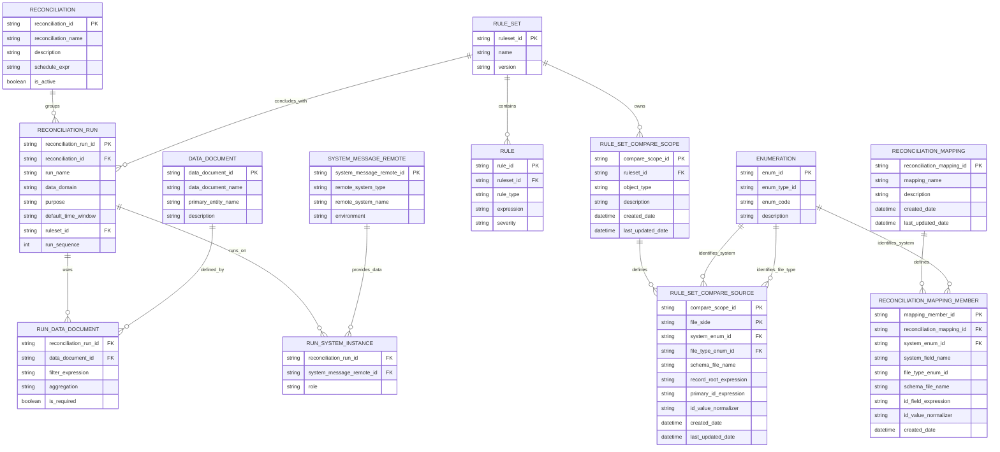

# Reconciliation Configuration Entity Model

This document maps the reconciliation configuration entities to their Moqui definitions in this repo.
The model focuses on configuration and definition storage only. Execution, auditing, and result storage
are intentionally out of scope.

## Source of Truth (Code)

- Reconciliation entities: `runtime/component/darpan/entity/ReconciliationEntities.xml`
- Rule entities: `runtime/component/darpan/entity/RuleEntities.xml`
- Mapping entities: `runtime/component/darpan/entity/MappingEntities.xml`
- DataDocument: `framework/entity/EntityEntities.xml`
- SystemMessageRemote: `framework/entity/ServiceEntities.xml`
- Enumeration: `framework/entity/BasicEntities.xml`

## Entity Relationship Diagram

**Note**
- The diagram uses snake_case field names for readability.
- Source-of-truth field names live in the entity XML files linked above.

## Model Goals

- Define what should be reconciled, not how
- Enable reusable reconciliation runs across clients
- Leverage Moqui-native entities wherever possible
- Keep configuration declarative and schedulable

## Core Entities

### Reconciliation (darpan.reconciliation.Reconciliation)
A schedulable parent entity that groups one or more reconciliation runs.

**Purpose**
- Acts as the orchestration boundary
- Defines scheduling cadence

**Key Fields**
- `reconciliationId`
- `reconciliationName`
- `description`
- `scheduleExpr`
- `isActive`

### ReconciliationRun (darpan.reconciliation.ReconciliationRun)
Defines a single reconciliation check within a reconciliation.

**Purpose**
- Represents one atomic comparison or validation
- Executed as part of a reconciliation group
- Reusable across clients if needed

**Key Fields**
- `reconciliationRunId`
- `reconciliationId`
- `runName`
- `dataDomain` (orders, returns, shipments)
- `purpose` (createdSync, statusMatch, financialMatch)
- `defaultTimeWindow`
- `ruleSetId`
- `runSequence`

**Example linkage**
- `darpan.reconciliation.ReconciliationRun(ruleSetId="INV_ADJ_DEFAULT_RS")` links to `darpan.rule.RuleSet(ruleSetId="INV_ADJ_DEFAULT_RS")`.

**Operational Note**
- Reconciliation ownership is no longer modeled with dedicated party entities in component configuration.

### DataDocument (moqui.entity.document.DataDocument)
Defines a canonical data point used in reconciliation.

**Purpose**
- Reusable metric definitions
- Source-agnostic representation of data

**Examples**
- Order count
- Total order amount
- Shipment count by status

**Key Fields**
- `dataDocumentId`
- `documentName`
- `primaryEntityName`

### RunDataDocument (darpan.reconciliation.RunDataDocument)
Associates DataDocuments with a ReconciliationRun.

**Purpose**
- Applies run-specific filters and aggregations
- Controls which metrics are mandatory

**Key Fields**
- `reconciliationRunId`
- `dataDocumentId`
- `filterExpression`
- `aggregation`
- `isRequired`

### SystemMessageRemote (moqui.service.message.SystemMessageRemote)
Represents an external or internal system instance.

**Purpose**
- Defines where data is sourced from
- Encapsulates integration details

**Examples**
- Shopify (Prod)
- OFBiz (Stage)
- NetSuite (Prod)

**Key Fields**
- `systemMessageRemoteId`
- `description`
- `sendUrl`
- `receiveUrl`
- `messageAuthEnumId`

### RunSystemInstance (darpan.reconciliation.RunSystemInstance)
Associates systems with a reconciliation run.

**Purpose**
- Defines the role of each system in a run
- Supports source, target, or peer comparisons

**Key Fields**
- `reconciliationRunId`
- `systemMessageRemoteId`
- `role`

### SftpServer (darpan.reconciliation.SftpServer)
Stores SFTP credentials used by reconciliation automation flows.

**Purpose**
- Defines reusable SFTP endpoints for file pickup/delivery
- Keeps credentials in encrypted entity fields

**Key Fields**
- `sftpServerId`
- `host`
- `port`
- `username`
- `password` (encrypted)
- `privateKey` (encrypted)
- `remoteAttributes`

### NsAuthConfig (darpan.reconciliation.NsAuthConfig)
Stores reusable NetSuite authentication profiles for endpoint calls.

**Purpose**
- Provides reusable NS auth settings shared by multiple endpoints
- Keeps authentication secrets encrypted in entity fields

**Key Fields**
- `nsAuthConfigId`
- `authType`
- `username`
- `password` (encrypted)
- `apiToken` (encrypted)
- `tokenUrl`
- `clientId`
- `certId`
- `privateKeyPem` (encrypted)
- `scope`
- `isActive`

### NsRestletConfig (darpan.reconciliation.NsRestletConfig)
Stores NetSuite Restlet endpoint connectivity for inventory adjustment retrieval.

**Purpose**
- Provides endpoint URL/method/headers and timeout settings
- Links each endpoint to an auth profile (`nsAuthConfigId`)

**Key Fields**
- `nsRestletConfigId`
- `endpointUrl`
- `httpMethod`
- `nsAuthConfigId`
- `headersJson`
- `connectTimeoutSeconds`
- `readTimeoutSeconds`
- `isActive`

### HcReadDbConfig (darpan.reconciliation.HcReadDbConfig)
Stores external read-only JDBC settings for inventory adjustment retrieval. Mapped table name: `READ_DB_CONFIG`.

**Purpose**
- Provides in-app configuration for external read-only database reads
- Centralizes table/column defaults used by retrieval services

**Key Fields**
- `hcReadDbConfigId`
- `displayName`
- `host`
- `port`
- `databaseName`
- `additionalParameters`
- `jdbcUrl`
- `username`
- `password` (encrypted)
- `dbDriver`
- `defaultTableName`
- `itemIdColumn`
- `locationIdColumn`
- `transactionDateColumn`
- `connectionPropertiesJson`
- `isActive`

### RuleSet and Rule (darpan.rule.RuleSet, darpan.rule.Rule)
Defines executable DRL decisioning for reconciliation runs.

**Purpose**
- Stores executable reconciliation rules.
- Owns compare scopes that define object identity and file-side primary ID extraction.
- DRL runs on matched object-pair facts after base compare has already emitted missing-object Diffs.
- Emits field or business-rule Diff outcomes such as SKU and price mismatches.

**RuleSet Key Fields**
- `ruleSetId`
- `ruleSetName`
- `version`
- `explosionPath` (legacy, still present on the entity)
- `primaryKeyPath` (legacy, still present on the entity)

**Rule Key Fields**
- `ruleId`
- `ruleSetId`
- `ruleText`
- `ruleLogic`
- `enabled`
- `ruleType`
- `expression`
- `severity`

### RuleSetCompareScope (darpan.rule.RuleSetCompareScope)
Defines the reconciliation object identity owned by a RuleSet.

**Purpose**
- Represents the compared object, such as Product, Order, OrderLine, or InventoryItem.
- Provides a stable scope key that later caller contracts can pass as `compareScopeId`.
- Groups the two file-side source definitions used for the same compare object.

**Key Fields**
- `compareScopeId`
- `ruleSetId`
- `objectType`
- `description`
- `createdDate`
- `lastUpdatedDate`

### RuleSetCompareSource (darpan.rule.RuleSetCompareSource)
Defines one file-side extraction contract for a compare scope.

**Purpose**
- Captures the file-side system and optional file type/schema metadata.
- Captures the record root and primary ID extraction expressions used to build the compared object set.
- Captures an optional ID normalizer so each file side can normalize IDs differently before compare.
- Restricts the model to one row per file side (`FILE_1`, `FILE_2`) for a given compare scope.

**Key Fields**
- `compareScopeId`
- `fileSide`
- `systemEnumId`
- `fileTypeEnumId`
- `schemaFileName`
- `recordRootExpression`
- `primaryIdExpression`
- `idValueNormalizer`
- `createdDate`
- `lastUpdatedDate`

**Example**
- A Product compare scope can use `FILE_1.primaryIdExpression="$.productId"` and `FILE_2.primaryIdExpression="$.id"` while keeping one shared `objectType="Product"`.

### ReconciliationMapping (darpan.mapping.ReconciliationMapping)
Defines a deprecated historical source extraction contract retained for migration.

**Purpose**
- Preserves existing Mapping-backed configuration long enough to migrate it to RuleSet compare scopes
- Provides the source key for the temporary `reconciliationMappingId` legacy bridge
- Should not be used for new Generic or SFTP setup after RuleSet cutover

**Key Fields**
- `reconciliationMappingId`
- `mappingName`
- `description`
- `createdDate`
- `lastUpdatedDate`

### ReconciliationMappingMember (darpan.mapping.ReconciliationMappingMember)
Stores one deprecated historical file-side extraction entry tied to a mapping and system enum.

**Purpose**
- Preserves existing system-specific record-id extraction details during migration
- Supplies file-side source data for `RuleSetCompareSource` migration
- Supports only the temporary legacy bridge for unmigrated jobs/callers

**Key Fields**
- `mappingMemberId`
- `reconciliationMappingId`
- `systemEnumId` (from `moqui.basic.Enumeration`)
- `systemFieldName`
- `fileTypeEnumId`
- `schemaFileName`
- `idFieldExpression`
- `idValueNormalizer`
- `createdDate`

### Historical Mapping Baseline and Compare-Scope Cutover
The reconciliation model now treats Mapping as historical migration input while RuleSet compare scopes own new setup:

- New Generic and SFTP setup should use RuleSet compare scopes for the compared object and per-file primary ID extraction.
- Mapping remains available only as legacy bridge configuration and migration input.
- The base compare stage emits missing-object Diffs before DRL:
  - `MISSING_IN_FILE_1`: primary ID exists in file 2 but not file 1.
  - `MISSING_IN_FILE_2`: primary ID exists in file 1 but not file 2.
- DRL receives only matched object pairs and emits field/business-rule Diffs.
- `reconciliation.ReconciliationMigrationServices.migrate#MappingsToRuleSetScopes` is the idempotent migration path from Mapping to RuleSet compare-scope configuration.
- The emitted result remains the existing Diff contract consumed by reconciliation screens and jobs.

**Operational Note**
- Do not create new Mapping rows for active setup. Migrate existing rows first, then remove `ReconciliationMappingMember` rows before deleting `ReconciliationMapping` to satisfy FK constraints (`MAPMEM_MAPDEF`).

## What Is Out of Scope (By Design)

- Execution tracking
- Data pull results
- Rule evaluation outcomes
- Alerts and notifications

These concerns will be introduced in a separate execution-layer model.

## Future Enhancements

- Execution entities (`ReconciliationExecution`, `RunExecution`)
- Rule evaluation result storage
- Alerting and notification hooks
- Moqui entity XML generation
