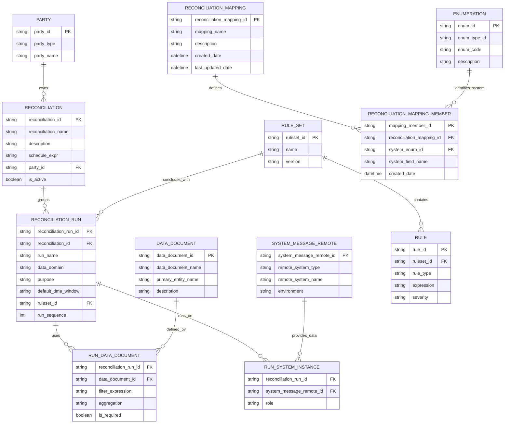

# Reconciliation Configuration Entity Model

This document maps the reconciliation configuration entities to their Moqui definitions in this repo.
The model focuses on configuration and definition storage only. Execution, auditing, and result storage
are intentionally out of scope.

## Source of Truth (Code)

- Reconciliation entities: `runtime/component/darpan/entity/ReconciliationEntities.xml`
- Mapping entities: `runtime/component/darpan/entity/MappingEntities.xml`
- Party entities: `runtime/component/darpan/entity/PartyEntities.xml`
- DataDocument: `framework/entity/EntityEntities.xml`
- SystemMessageRemote: `framework/entity/ServiceEntities.xml`
- Enumeration: `framework/entity/BasicEntities.xml`

## Entity Relationship Diagram

**Note**
- The diagram uses snake_case field names for readability.
- Source-of-truth field names live in the entity XML files linked above.

## Model Goals

- Define what should be reconciled, not how
- Enable reusable reconciliation runs across clients
- Leverage Moqui-native entities wherever possible
- Keep configuration declarative and schedulable

## Core Entities

### Reconciliation (darpan.reconciliation.Reconciliation)
A schedulable parent entity that groups one or more reconciliation runs.

**Purpose**
- Acts as the orchestration boundary
- Defines scheduling cadence
- Scoped to a client via `darpan.party.Party`

**Key Fields**
- `reconciliationId`
- `reconciliationName`
- `description`
- `scheduleExpr`
- `partyId`
- `isActive`

### ReconciliationRun (darpan.reconciliation.ReconciliationRun)
Defines a single reconciliation check within a reconciliation.

**Purpose**
- Represents one atomic comparison or validation
- Executed as part of a reconciliation group
- Reusable across clients if needed

**Key Fields**
- `reconciliationRunId`
- `reconciliationId`
- `runName`
- `dataDomain` (orders, returns, shipments)
- `purpose` (createdSync, statusMatch, financialMatch)
- `defaultTimeWindow`
- `ruleSetId`
- `runSequence`

### Party (darpan.party.Party)
Represents the client, merchant, or tenant.

**Purpose**
- Multi-tenant isolation
- Ownership of reconciliation configurations

**Key Fields**
- `partyId`
- `partyTypeId`
- `partyName`

### DataDocument (moqui.entity.document.DataDocument)
Defines a canonical data point used in reconciliation.

**Purpose**
- Reusable metric definitions
- Source-agnostic representation of data

**Examples**
- Order count
- Total order amount
- Shipment count by status

**Key Fields**
- `dataDocumentId`
- `documentName`
- `primaryEntityName`

### RunDataDocument (darpan.reconciliation.RunDataDocument)
Associates DataDocuments with a ReconciliationRun.

**Purpose**
- Applies run-specific filters and aggregations
- Controls which metrics are mandatory

**Key Fields**
- `reconciliationRunId`
- `dataDocumentId`
- `filterExpression`
- `aggregation`
- `isRequired`

### SystemMessageRemote (moqui.service.message.SystemMessageRemote)
Represents an external or internal system instance.

**Purpose**
- Defines where data is sourced from
- Encapsulates integration details

**Examples**
- Shopify (Prod)
- OFBiz (Stage)
- NetSuite (Prod)

**Key Fields**
- `systemMessageRemoteId`
- `description`
- `sendUrl`
- `receiveUrl`
- `messageAuthEnumId`

### RunSystemInstance (darpan.reconciliation.RunSystemInstance)
Associates systems with a reconciliation run.

**Purpose**
- Defines the role of each system in a run
- Supports source, target, or peer comparisons

**Key Fields**
- `reconciliationRunId`
- `systemMessageRemoteId`
- `role`

### SftpServer (darpan.reconciliation.SftpServer)
Stores SFTP credentials used by reconciliation automation flows.

**Purpose**
- Defines reusable SFTP endpoints for file pickup/delivery
- Keeps credentials in encrypted entity fields

**Key Fields**
- `sftpServerId`
- `host`
- `port`
- `username`
- `password` (encrypted)
- `privateKey` (encrypted)
- `remoteAttributes`

### NsAuthConfig (darpan.reconciliation.NsAuthConfig)
Stores reusable NetSuite authentication profiles for endpoint calls.

**Purpose**
- Provides reusable NS auth settings shared by multiple endpoints
- Keeps authentication secrets encrypted in entity fields

**Key Fields**
- `nsAuthConfigId`
- `authType`
- `username`
- `password` (encrypted)
- `apiToken` (encrypted)
- `tokenUrl`
- `clientId`
- `certId`
- `privateKeyPem` (encrypted)
- `scope`
- `isActive`

### NsRestletConfig (darpan.reconciliation.NsRestletConfig)
Stores NetSuite Restlet endpoint connectivity for inventory adjustment retrieval.

**Purpose**
- Provides endpoint URL/method/headers and timeout settings
- Links each endpoint to an auth profile (`nsAuthConfigId`)

**Key Fields**
- `nsRestletConfigId`
- `endpointUrl`
- `httpMethod`
- `nsAuthConfigId`
- `headersJson`
- `connectTimeoutSeconds`
- `readTimeoutSeconds`
- `isActive`

### HcReadDbConfig (darpan.reconciliation.HcReadDbConfig)
Stores external read-only JDBC settings for inventory adjustment retrieval. Mapped table name: `READ_DB_CONFIG`.

**Purpose**
- Provides in-app configuration for external read-only database reads
- Centralizes table/column defaults used by retrieval services

**Key Fields**
- `hcReadDbConfigId`
- `displayName`
- `host`
- `port`
- `databaseName`
- `additionalParameters`
- `jdbcUrl`
- `username`
- `password` (encrypted)
- `dbDriver`
- `defaultTableName`
- `itemIdColumn`
- `locationIdColumn`
- `transactionDateColumn`
- `connectionPropertiesJson`
- `isActive`

### RuleSet and Rule (darpan.rule.RuleSet, darpan.rule.Rule)
Defines conclusion logic for reconciliation runs.

**Purpose**
- Determines success, warnings, or failures
- Encapsulates business tolerances and thresholds

**RuleSet Key Fields**
- `ruleSetId`
- `ruleSetName`
- `version`

**Rule Key Fields**
- `ruleId`
- `ruleSetId`
- `ruleText`
- `ruleLogic`
- `enabled`
- `ruleType`
- `expression`
- `severity`

### ReconciliationMapping (darpan.mapping.ReconciliationMapping)
Defines a named mapping set for reconciliation system fields.

**Purpose**
- Groups mapping entries under a stable name

**Key Fields**
- `reconciliationMappingId`
- `mappingName`
- `description`
- `createdDate`
- `lastUpdatedDate`

### ReconciliationMappingMember (darpan.mapping.ReconciliationMappingMember)
Stores a single mapping entry tied to a mapping and system enum.

**Purpose**
- Captures system-specific field names
- Enables field-level mapping by system

**Key Fields**
- `mappingMemberId`
- `reconciliationMappingId`
- `systemEnumId` (from `moqui.basic.Enumeration`)
- `systemFieldName`
- `createdDate`

**Operational Note**
- Mapping deletion should remove `ReconciliationMappingMember` rows first, then delete `ReconciliationMapping` to satisfy FK constraints (`MAPMEM_MAPDEF`).

## What Is Out of Scope (By Design)

- Execution tracking
- Data pull results
- Rule evaluation outcomes
- Alerts and notifications

These concerns will be introduced in a separate execution-layer model.

## Future Enhancements

- Execution entities (`ReconciliationExecution`, `RunExecution`)
- Rule evaluation result storage
- Alerting and notification hooks
- Moqui entity XML generation
