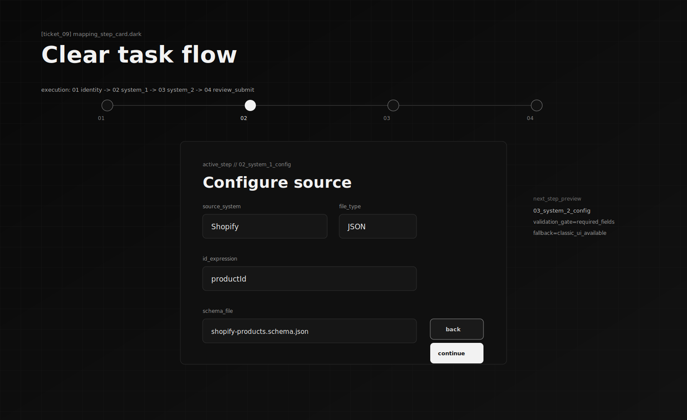
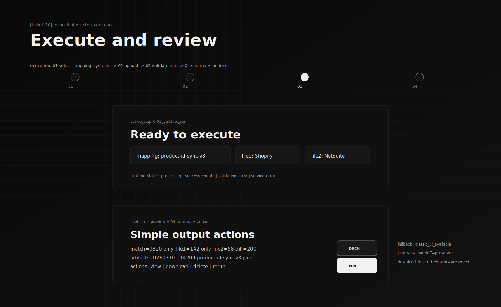
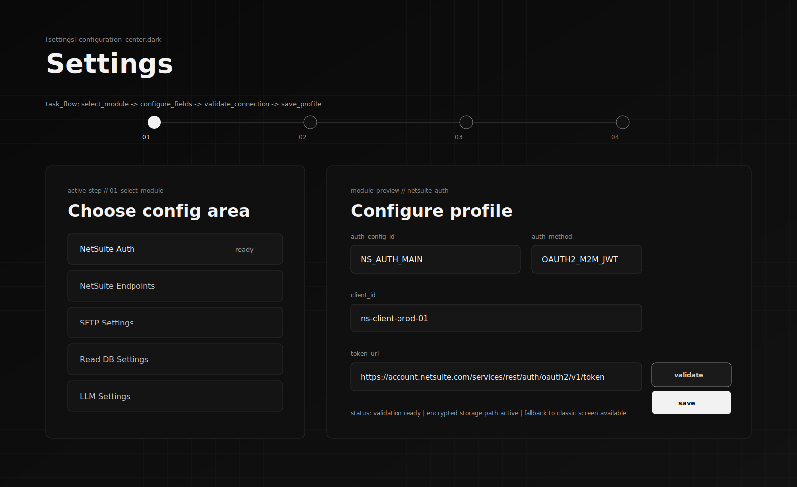
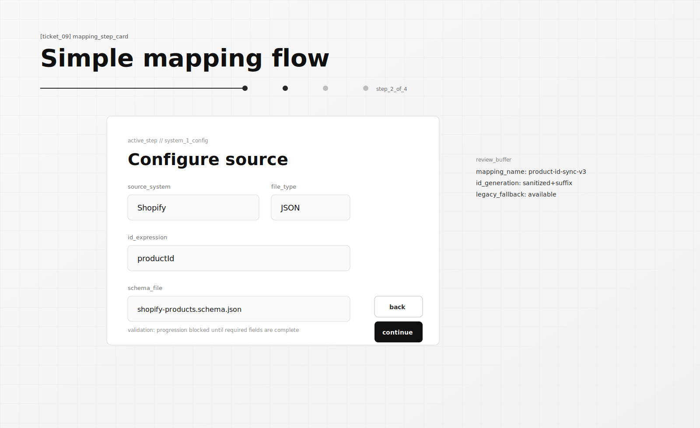
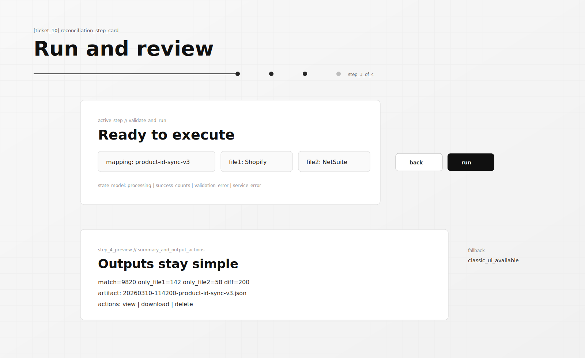
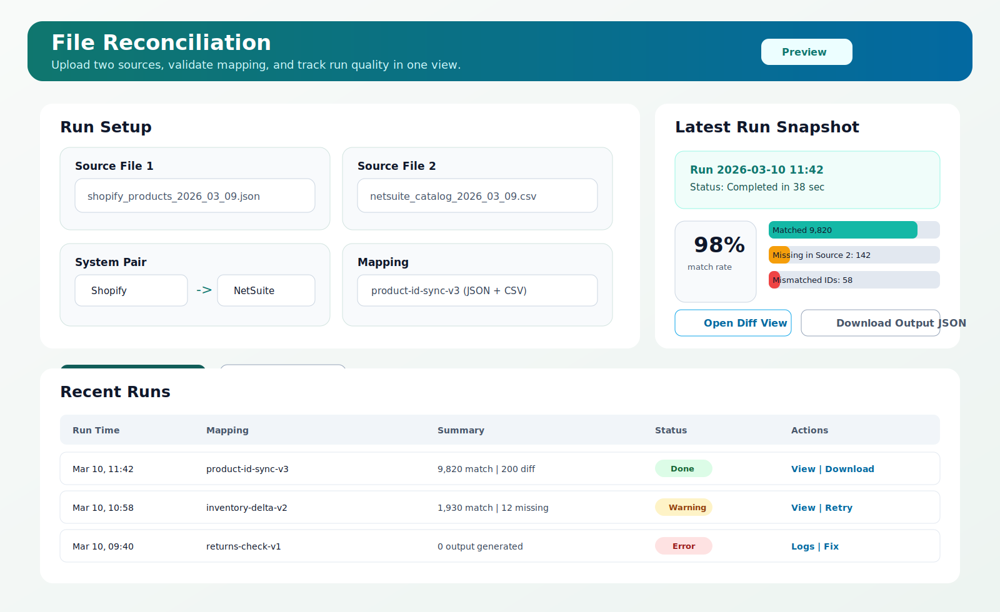
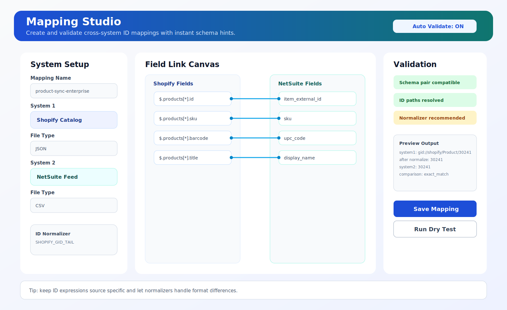
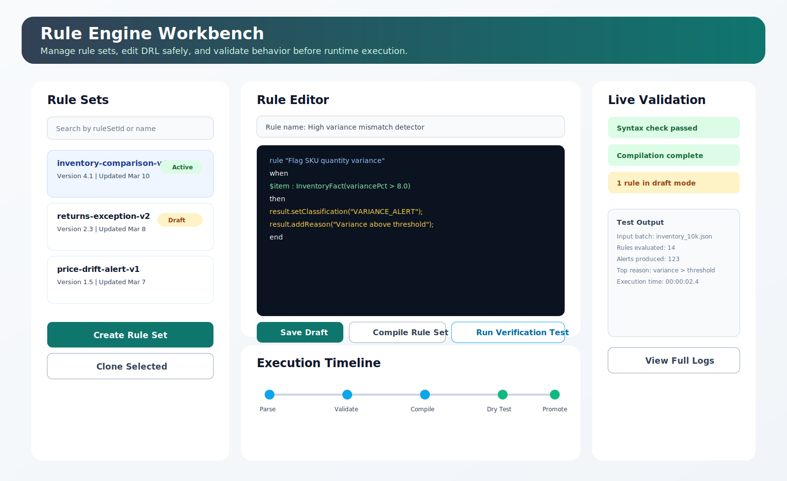

# Darpan UI Mockups

This document tracks UI mockups only (no implementation changes), aligned to current enhancement tickets.

## Current Ticket Mockups (Dark Mode)

1. `#9` Mapping Step-Card Flow (Dark)

2. `#10` Generic Reconciliation Step-Card Flow (Dark)

## Settings Mockup (Dark Mode)

1. Settings Page (Dark Minimal Technical)

## Previous Ticket Variants (Kept)

1. `#9` Mapping Step-Card Flow (Minimal Light)

2. `#10` Generic Reconciliation Step-Card Flow (Minimal Light)

## Earlier Concept Mockups

1. Reconciliation Run Center

2. Mapping Studio

3. Rule Engine Workbench

## Notes

- These are design artifacts only.
- No menu/navigation or runtime behavior changed in this mockup pass.
- Figma-specific fidelity pass can be done once a frame link or node selection is shared.
